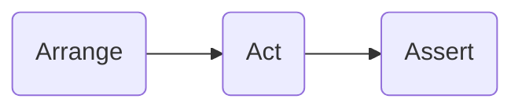
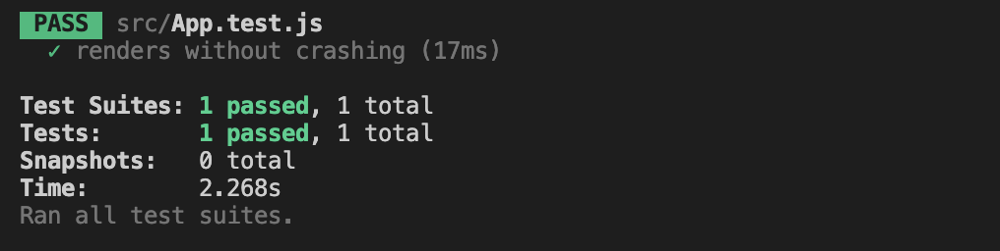

# React Testing


## Testing Fundamentals

### Types of testing

* **Unit testing**: testing an isolated part of the app. In react, it usually done with shallow rendering.
* **Integration testing**: testing if different parts work or integrate with each other. In react, it is usually done with mounting or rendering a component. (Test if a child component can update the context state in a parent).
* **E2E testing**: Usually a multi step test combining multiple unit and integration tests into one big test. **Usually very little is mocked or stubbed**. Tests are done in a simulated browser, there may or may not be a UI while the test is running. (Example: test an entire authentication flow)

### The Arrange-Act-Assert (AAA) pattern in testing

Testing is a three step process that looks like:



* **Arrange**: In the arrange section, you have the code to setup the test. You arrange your app in a certain original state. (Objects created, mocks setup, etc.)
* **Act**: In the act section, you have the invocation of method to be tested. For example, click event, input.
* **Assert**: In the assertion part, you would check whether all the expectations are met.

### Tests in React

The tests in React are not executed in the browser, they need a **Test Runner** such as `jest`, `mocha` to run these tests. With test runner, we can write test suites as regular JavaScript.

### Why test

* Enusre the app work as intended
* Make the app more robust and less error prone
* Serve as description for the code

### What to test

The tests should test the functionality of the app and mimics how it will be used by the end users.

Implementation details meaning testing things that are not end user functionality.

### What not to test

You should not test implementation details, such as names of functions and variables. The implementation details can change.

## Approaches to test React Components

- **Rendering component trees** in a simplified test environment and asserting on their output.
- **Running a complete app** in a realistic browser environment (also known as “end-to-end” tests).

### Shallow vs Mount

## Testing Frameworks

### 1. Jest

Jest is a *node-based test runner* allowing fast parallel running of tests in a node environment.

Jest is widely compatible with React projects, supporting features like mocked [modules](https://reactjs.org/docs/testing-environments.html#mocking-modules) and [timers](https://reactjs.org/docs/testing-environments.html#mocking-timers), and [`jsdom`](https://reactjs.org/docs/testing-environments.html#mocking-a-rendering-surface) support.

**It works out of the box within any [Create React App](https://github.com/facebook/create-react-app) project.**

Jest is intended to be used for **unit tests** of your logic and your components rather than the DOM quirks.

Running `npm test` in a Terminal window within your app directory will initialise Jest and start testing in watch mode.

#### 1.1 Start using Jest

Jest discovers file names in your project via file names, of which can be found at any depth of the project. There are three naming conventions for Jest to pick up the tests:

* Any file with a `.test.js` or a `.spec.js` suffix. It is preferable when a component file `App.js` can be accompanied by a test file `App.test.js` or `App.spec.js` at the same folder. It optimizes discoverability and keeps import statements to a minimum.
* Any `.js` file within `__tests__` folders throughout your project. It is useful if you have multiple test files to test a particular component or component directory. In this case your components and tests are not mixed. It is preferable in larger projects.

#### 1.2 The default `App.test.js`

`create-react-app` creates a default `App.test.js` file to serve the test of `App.js` component test.

```jsx
// App.test.js
import React from 'react';
import ReactDOM from 'react-dom';
import App from './App';

it('renders without crashing', () => {
  const div = document.createElement('div');
  ReactDOM.render(<App />, div);
  ReactDOM.unmountComponentAtNode(div);
});
```

Run the tests:

```shell
npm run test
```

And it will give the following results



#### 1.3 Writing the first test


